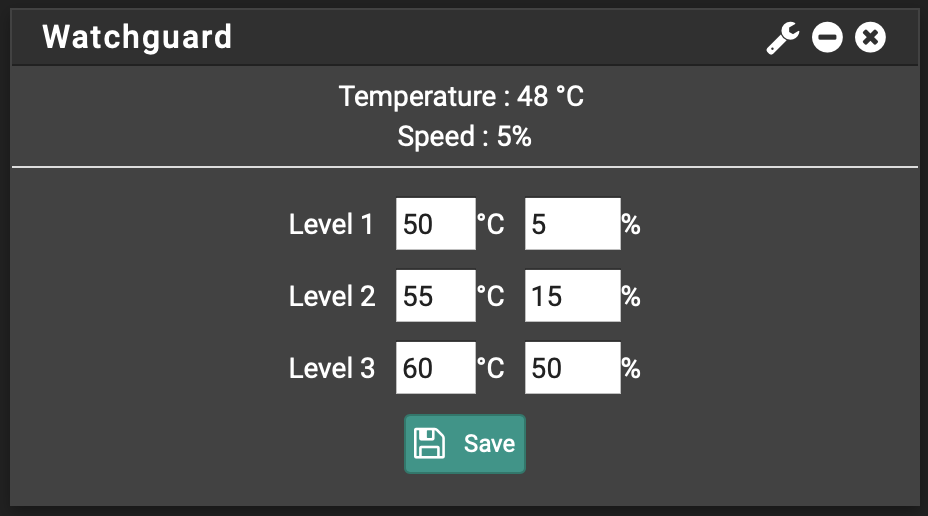

# pfSense-Watchguard-widget
A simple widget to control fan of Watchguard appliance from pfSense web interface

Widget using [WGXepc](https://github.com/stephenw10/WGXepc)



## To install

from pfSense shell :

```
curl https://raw.githubusercontent.com/H4ckd4ddy/pfSense-Watchguard-widget/master/install.sh | sh
```
